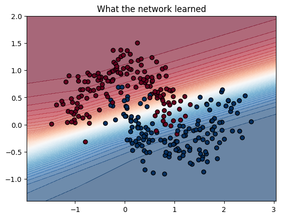
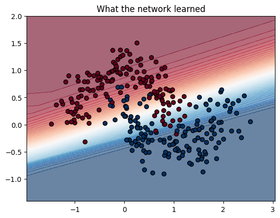
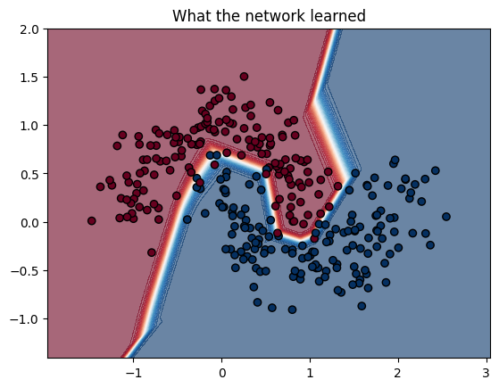

# Moons classifier from scratch

A small 2-layer neural network, built from scratch in PyTorch (no shortcuts), trained on the classic two-moons dataset from sklearn. This was also my first time working with the [make_moons dataset](https://scikit-learn.org/stable/modules/generated/sklearn.datasets.make_moons.html) itself, a synthetic dataset shaped like two interleaving crescents, specifically designed to not be separable by a straight line. What started as a simple exercise turned into a real debugging story, including a dying ReLU bug that took a bit of digging to figure out.

## What's here

- A basic PyTorch model (2 to hidden to 1) trained with BCELoss (Binary Cross-Entropy Loss) and Adam
- Decision boundary visualizations at three stages of training
- A writeup of a real bug I hit along the way and how I fixed it

## The debugging story

**Attempt 1:** Trained for only 200 epochs. The decision boundary came out as a straight line, completely failing to separate the two crescents.



**Attempt 2:** Bumped training up to 2000 epochs. The boundary started bending, but loss got stuck flat at 0.2799 for over 1500 epochs and never improved further.



Intuition: this was likely a **dying ReLU** problem. With only 8 hidden neurons, a few of them ended up permanently stuck outputting 0, which meant they stopped receiving any gradient and could never recover.

**Fix:** Increased the hidden layer from 8 to 32 neurons, giving the network enough redundancy that even if a few neurons die, plenty of live ones remain. Loss dropped to 0.046, and the boundary properly bent around both crescents.



## Running it locally

```bash
git clone https://github.com/adrikachowdhury/moons-classifier-from-scratch.git
cd moons-classifier-from-scratch
pip install -r requirements.txt
python train.py
python plot_boundary.py
```

## Project structure
```
moons-classifier-from-scratch/
├── README.md
├── train.py          # your model + training loop
├── plot_boundary.py  # the visualization code
├── requirements.txt  # torch, numpy, scikit-learn, matplotlib
└── plots/
    ├── linear_boundary.png       # your first (broken) plot
    ├── plateau_boundary.png      # the stuck-at-0.28 one
    └── final_boundary.png        # the fixed, curved one
```

## What I took away from this

- A network with too few hidden units is vulnerable to losing several neurons to dying ReLU, especially with unlucky initialization
- A flat or stuck loss is a different problem from "just needs more training", worth checking model capacity, not just epoch count
- Always visualize the decision boundary; the loss number alone doesn't tell you the full story

## Acknowledgement

Built while working through concepts with Claude (Anthropic), who walked me through the debugging process step by step.
