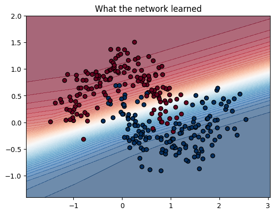
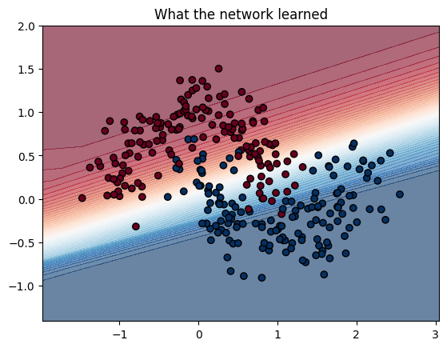
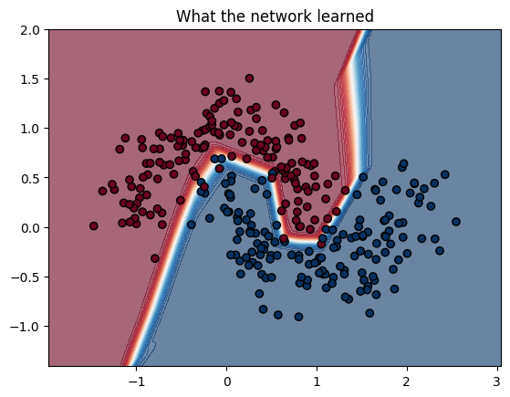

# Moons classifier from scratch

A _small 2-layer neural network_, built from scratch in PyTorch (no shortcuts), trained on the classic two-moons dataset from sklearn. This was also my first time working with the [make_moons dataset](https://scikit-learn.org/stable/modules/generated/sklearn.datasets.make_moons.html) itself, a synthetic dataset where the data points are scattered as two interleaving crescent (moon) shapes, specifically designed to not be separable by a straight line. What started as a simple exercise turned into a real debugging story, including a dying ReLU bug that took a bit of digging to figure out.

## What's here

- A basic PyTorch model (2 to hidden to 1) trained with BCELoss (Binary Cross-Entropy Loss) and Adam
- Decision boundary visualizations at three stages of training
- A write-up of a real bug I hit along the way and how I fixed it

## The debugging story

**Attempt 1:** Trained for only 200 epochs. The decision boundary came out as a straight line, completely failing to separate the two crescents.



**Attempt 2:** Bumped training up to 2000 epochs. The boundary started bending, but loss got stuck flat at 0.2799 for over 1500 epochs and never improved further.



Intuition: this was likely a **dying ReLU** problem. With only 8 hidden neurons, a few of them ended up permanently stuck outputting 0, which meant they stopped receiving any gradient and could never recover.

**Fix:** Increased the hidden layer from 8 to 32 neurons, giving the network enough redundancy that even if a few neurons die, plenty of live ones remain. Loss dropped to 0.046, and the boundary properly bent around both crescents.



## Running it locally

```bash
git clone https://github.com/adrikachowdhury/moons-classifier-from-scratch.git
cd moons-classifier-from-scratch
pip install -r requirements.txt
python train.py
python plot_boundary.py
```
## Run the Notebook

If you want to test this out on a notebook like Google Colab, then try moonsclassifier_notebook.ipynb.

## Project structure
```
moons-classifier-from-scratch/
├── README.md
├── train.py                         # the model + training loop
├── plot_boundary.py                 # the visualization code
├── requirements.txt                 # torch, numpy, scikit-learn, matplotlib
├── moonsclassifier_notebook.ipynb   # notebook file of the whole implementation with necessary documentation inside
└── plots/
    ├── Attempt1.png                 
    ├── Attempt2.png                 
    └── FinalAttempt.png             
```

## Key learnings
### Concepts
- A neural net layer computes (weights × input) + bias, then applies an activation function
- ReLU is what lets the network learn curves. Without it, stacked linear layers collapse into one straight line
- Sigmoid + BCELoss are the standard pairing for binary classification
- Training loop: forward pass → loss → zero_grad() → backward() → step() → repeat
- A gradient is a slope: "how much does the loss change if I nudge this parameter?" Zero slope means no update

### Debugging Lessons
- A wrong-looking result has more than one possible cause. Attempt 1 (straight line) was undertraining. Attempt 2 (stuck loss) was a different problem, model capacity (dying ReLU)
- A loss stuck completely flat is a different symptom from a loss that is still slowly falling. Flat means "stuck", not "needs more time"
- Loss numbers alone don't tell the full story. Plotting the decision boundary showed what the model actually learned
- Widening the layer (8 → 32) worked as redundancy: even if some neurons die, enough live ones remain
- Form a hypothesis, test it with one change, and check the result
  
## Acknowledgement

Built while working through concepts with Claude (Anthropic), who walked me through the debugging process step by step.
